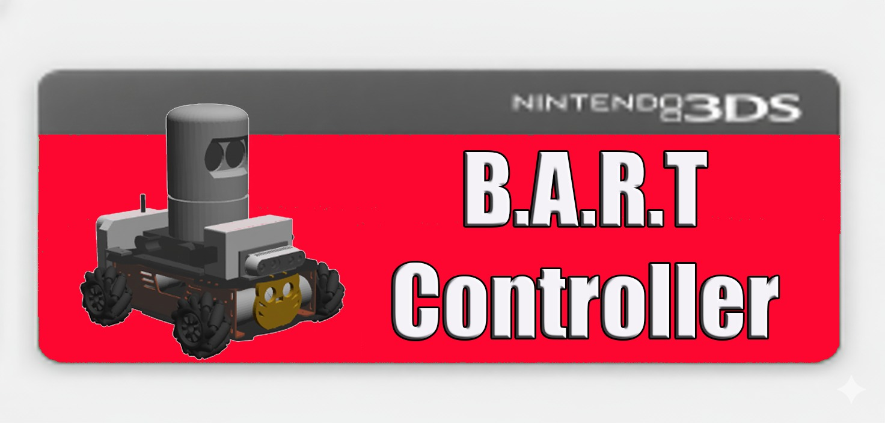

# 🎮 B.A.R.T Controller — Rover Control Hub

> 🌐 **Selecione o idioma / Choose your language**

<b>🇧🇷 Português (Brasil)</b>

 

## ⚠️ AVISO — REPOSITÓRIO VITRINE ⚠️

Este repositório é uma **vitrine pública** do projeto **BARTController**.

O **código-fonte completo é mantido em um repositório privado**, pois contém informações sensíveis que não devem ser compartilhadas publicamente.

Aqui você encontrará:

- ✅ Descrição do projeto e funcionalidades
- ✅ Demonstrações 
- ✅ Tecnologias utilizadas
- ✅ Formas de contato para mais informações

📧 **Para acesso ao código, colaborações ou dúvidas:** entre em contato pelo e-mail informado na seção [Contato](#-contato).

---

## ⚠️ AVISOS IMPORTANTES ⚠️

Este software é um *homebrew* **exclusivamente** desenvolvido para o console **Nintendo 3DS com Custom Firmware (CFW) instalado**.

**A aplicação não irá funcionar em consoles com as especificações originais/de fábrica.** É necessário que o seu 3DS esteja desbloqueado (Luma3DS) para que o programa possa acessar as funcionalidades de rede e recursos de sistema necessários.

Este desenvolvimento utilizou como base os seguintes repositórios e sites:

- **Para o desbloqueio do dispositivo:** https://3ds.hacks.guide/
- **Base para o desenvolvimento de programas no dispositivo:** https://github.com/devkitpro
- **Base para o streamer da tela:** https://github.com/MC-Gaming-59o/Homebrew-3DS-IP-Webcam-Viewer
- **Base para a comunicação UDP (envio de comandos):** https://github.com/CTurt/3DSController
- **Ferramenta para a criação do arquivo .cia:** https://github.com/3DSGuy/Project_CTR
- **Ferramenta para a criação de banners e ícones:** https://github.com/carstene1ns/3ds-bannertool/tags

---

## 📋 Sumário

- [🚀 Sobre o BARTController](#-sobre-o-bartcontroller)
- [✨ Funcionalidades Principais](#-funcionalidades-principais)
- [🎥 Demonstração](#-demonstração)
- [⚙️ Base do Projeto e Tecnologias](#️-base-do-projeto-e-tecnologias)
- [📬 Contato](#-contato)
- [📄 Licença de uso](#-licença-de-uso)

---

## 🚀 Sobre o BARTController

O `BARTController` é uma aplicação *homebrew* para o Nintendo 3DS que transforma o console em uma **central de comando e monitoramento em tempo real** para o rover omnidirecional **BART** (Basic Autonomous Rover for Testing).

Utilizando os controles e as duas telas do 3DS, o sistema permite o controle do movimento do rover (movimentos diferenciais e omnidirecionais), o controle da modalidade da câmera (RGB e de Profundidade), além de fornecer *feedback* visual em tempo real.

Este projeto integra o console portátil com o ambiente **ROS Noetic**, criando uma ponte de comunicação entre o **3DS** e o **robô**, capaz de transmitir e receber dados em tempo real.

---

### ✨ Funcionalidades Principais

#### 🔹 Protocolo de Comunicação

O sistema utiliza dois protocolos principais de comunicação.

O **UDP**, responsável pelo envio de comandos e controle de movimento, e o **HTTP**, dedicado ao recebimento de dados e visualização de informações, como endereços e portas de conexão.

Tudo acontece em uma comunicação **full duplex**, onde tanto o console quanto o computador trocam dados continuamente, ou seja, o **3DS** atua como **servidor e cliente** simultaneamente.

#### 🔹 Controles nativos

O Homebrew aproveita os controles nativos do **3DS** para o comando do rover:

- **Joystick/Circle Pad:** Controla os movimentos lineares e angulares do rover BART.
- **Botão A:** Utilizado para habilitar e desabilitar o modo omnidirecional e o modo diferencial.
- **Botão Y:** Utilizado para iniciar a comunicação com o computador.
- **Botão X:** Utilizado para transitar entre a câmera colorida e a de profundidade.
- **Botão START:** Utilizado para finalizar de forma limpa e segura o aplicativo.

#### 🔹 Visualização em Duas Telas

- **Tela Superior (Câmera):** Exibe o *feed* de vídeo em tempo real da **câmera RealSense** acoplada ao rover (via comunicação IP).
- **Tela Inferior (Informações):** Exibe as informações principais do *homebrew*, isto é, IPs e Portas para a comunicação UDP e HTTP, além da descrição dos principais botões e suas funcionalidades.

---

## 🎥 Demonstração

📺 **Vídeo demonstrativo completo:** [https://youtu.be/yKQONUHc8ik](https://youtu.be/yKQONUHc8ik)

---

### ⚙️ Base do Projeto e Tecnologias

| Componente | Detalhes |
| :--- | :--- |
| **Plataforma Alvo** | Nintendo 3DS com Custom Firmware (CFW) |
| **Ferramenta de Desenvolvimento** | **devkitPro** (`devkitARM`, `libctru`) |
| **Base Inicial** | Homebrew-3DS-IP-Webcam-Viewer e 3DSController |

---

## 📬 Contato

Este projeto possui **código-fonte privado**. Para:

- 🔑 Solicitar acesso ao código
- 🤝 Propor colaborações
- ❓ Tirar dúvidas técnicas

Entre em contato:

- 📧 **E-mail:** [seu-email@exemplo.com](mailto:felipefurlaneto01@gmail.com)
- 🐙 **GitHub:** [@FelipePF22](https://github.com/FelipePF22)
- 💼 **LinkedIn:** [seu-perfil](https://www.linkedin.com/in/felipepereira56/)

---

## 📄 Licença de uso

MIT License

Copyright (c) 2025 BARTController

Permission is hereby granted, free of charge, to any person obtaining a copy
of this software and associated documentation files (the "Software"), to deal
in the Software without restriction, including without limitation the rights
to use, copy, modify, merge, publish, distribute, sublicense, and/or sell
copies of the Software, and to permit persons to whom the Software is
furnished to do so, subject to the following conditions:

The above copyright notice and this permission notice shall be included in all
copies or substantial portions of the Software.

THE SOFTWARE IS PROVIDED "AS IS", WITHOUT WARRANTY OF ANY KIND, EXPRESS OR
IMPLIED, INCLUDING BUT NOT LIMITED TO THE WARRANTIES OF MERCHANTABILITY,
FITNESS FOR A PARTICULAR PURPOSE AND NONINFRINGEMENT. IN NO EVENT SHALL THE
AUTHORS OR COPYRIGHT HOLDERS BE LIABLE FOR ANY CLAIM, DAMAGES OR OTHER
LIABILITY, WHETHER IN AN ACTION OF CONTRACT, TORT OR OTHERWISE, ARISING FROM,
OUT OF OR IN CONNECTION WITH THE SOFTWARE OR THE USE OR OTHER DEALINGS IN THE
SOFTWARE.

<b>🇺🇸 English</b>

 

## ⚠️ NOTICE — SHOWCASE REPOSITORY ⚠️

This repository is a **public showcase** of the **BARTController** project.

The **full source code is kept in a private repository**, as it contains sensitive information that should not be shared publicly.

Here you will find:

- ✅ Project description and features
- ✅ Demonstrations 
- ✅ Technologies used
- ✅ Contact information for further inquiries

📧 **For source code access, collaborations, or questions:** please reach out via the email listed in the [Contact](#-contact) section.

---

## ⚠️ IMPORTANT NOTICES ⚠️

This software is a *homebrew* application developed **exclusively** for the **Nintendo 3DS console with Custom Firmware (CFW) installed**.

**The application will not work on consoles with original/factory specifications.** Your 3DS must be unlocked (Luma3DS) so the program can access the required network features and system resources.

This development used the following repositories and sites as a base:

- **For unlocking the device:** https://3ds.hacks.guide/
- **Base for developing programs on the device:** https://github.com/devkitpro
- **Base for the screen streamer:** https://github.com/MC-Gaming-59o/Homebrew-3DS-IP-Webcam-Viewer
- **Base for UDP communication (command sending):** https://github.com/CTurt/3DSController
- **Tool for creating the .cia file:** https://github.com/3DSGuy/Project_CTR
- **Tool for creating banners and icons:** https://github.com/carstene1ns/3ds-bannertool/tags

---

## 📋 Table of Contents

- [🚀 About BARTController](#-about-bartcontroller)
- [✨ Main Features](#-main-features)
- [🎥 Demo](#-demo)
- [⚙️ Project Base and Technologies](#️-project-base-and-technologies)
- [📬 Contact](#-contact)
- [📄 License](#-license)

---

## 🚀 About BARTController

`BARTController` is a *homebrew* application for the Nintendo 3DS that turns the console into a **real-time command and monitoring hub** for the omnidirectional rover **BART** (Basic Autonomous Rover for Testing).

Using the 3DS controls and its two screens, the system allows control of the rover's movement (differential and omnidirectional motion), camera mode selection (RGB and Depth), and provides real-time visual *feedback*.

This project integrates the portable console with the **ROS Noetic** environment, creating a communication bridge between the **3DS** and the **robot**, capable of transmitting and receiving data in real time.

---

### ✨ Main Features

#### 🔹 Communication Protocol

The system uses two main communication protocols.

**UDP**, responsible for sending commands and motion control, and **HTTP**, dedicated to receiving data and displaying information such as connection addresses and ports.

Everything happens over **full-duplex** communication, where both the console and the computer continuously exchange data — that is, the **3DS** acts as **server and client** simultaneously.

#### 🔹 Native Controls

The Homebrew leverages the **3DS**'s native controls to command the rover:

- **Joystick/Circle Pad:** Controls the linear and angular movements of the BART rover.
- **A Button:** Used to enable and disable omnidirectional and differential modes.
- **Y Button:** Used to start communication with the computer.
- **X Button:** Used to switch between the color and depth cameras.
- **START Button:** Used to cleanly and safely terminate the application.

#### 🔹 Dual-Screen Visualization

- **Top Screen (Camera):** Displays the real-time video *feed* from the **RealSense camera** attached to the rover (via IP communication).
- **Bottom Screen (Information):** Displays the main *homebrew* information — IPs and Ports for UDP and HTTP communication, plus a description of the main buttons and their functions.

---

## 🎥 Demo

📺 **Full demo video:** [https://youtu.be/yKQONUHc8ik](https://youtu.be/yKQONUHc8ik)

---

### ⚙️ Project Base and Technologies

| Component | Details |
| :--- | :--- |
| **Target Platform** | Nintendo 3DS with Custom Firmware (CFW) |
| **Development Tool** | **devkitPro** (`devkitARM`, `libctru`) |
| **Initial Base** | Homebrew-3DS-IP-Webcam-Viewer and 3DSController |

---

## 📬 Contact

This project has a **private source code**. To:

- 🔑 Request source code access
- 🤝 Propose collaborations
- ❓ Ask technical questions

Get in touch:

- 📧 **E-mail:** [seu-email@exemplo.com](mailto:felipefurlaneto01@gmail.com)
- 🐙 **GitHub:** [@FelipePF22](https://github.com/FelipePF22)
- 💼 **LinkedIn:** [seu-perfil](https://www.linkedin.com/in/felipepereira56/)
---

## 📄 License

MIT License

Copyright (c) 2025 BARTController

Permission is hereby granted, free of charge, to any person obtaining a copy
of this software and associated documentation files (the "Software"), to deal
in the Software without restriction, including without limitation the rights
to use, copy, modify, merge, publish, distribute, sublicense, and/or sell
copies of the Software, and to permit persons to whom the Software is
furnished to do so, subject to the following conditions:

The above copyright notice and this permission notice shall be included in all
copies or substantial portions of the Software.

THE SOFTWARE IS PROVIDED "AS IS", WITHOUT WARRANTY OF ANY KIND, EXPRESS OR
IMPLIED, INCLUDING BUT NOT LIMITED TO THE WARRANTIES OF MERCHANTABILITY,
FITNESS FOR A PARTICULAR PURPOSE AND NONINFRINGEMENT. IN NO EVENT SHALL THE
AUTHORS OR COPYRIGHT HOLDERS BE LIABLE FOR ANY CLAIM, DAMAGES OR OTHER
LIABILITY, WHETHER IN AN ACTION OF CONTRACT, TORT OR OTHERWISE, ARISING FROM,
OUT OF OR IN CONNECTION WITH THE SOFTWARE OR THE USE OR OTHER DEALINGS IN THE
SOFTWARE.

